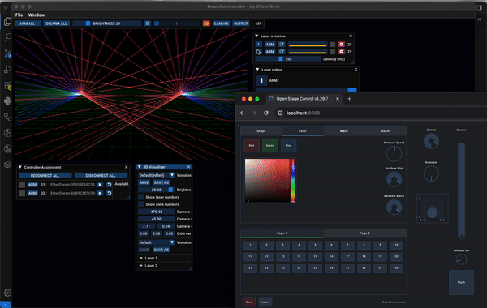
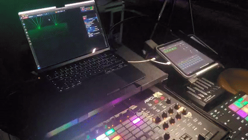

# BeamCommander - Laser Control System

BeamCommander is a comprehensive laser control system that bridges OSC (Open Sound Control) commands with laser hardware, providing real-time visual effects for performances and installations.

**Live Performance Ready**: Control your lasers in real-time using an Akai APC40 MIDI controller and/or intuitive web interface. Designed specifically for live performances, VJ sets, and externally controlled laser shows via OSC commands. Perfect for artists, performers, and installation designers who need responsive, tactile control over complex laser visuals.

## Demo



*Real-time laser control demonstration showing Open Stage Control interface integration with BeamCommander*



*Live performance demonstration with Akai APC40 MIDI controller and iPad (Open Stage Control browser UI) controlling laser effects in real-time*

## Quick Start (Users)

### How to Run BeamCommander

1. **Download the Release Binary**
   - Go to the [Releases](https://github.com/oliverbyte/beamcommander/releases) page
   - Download the latest release for Mac
   - Extract the downloaded archive

2. **Run BeamCommander**
   - Double-click `BeamCommander.app` or run it from terminal
   - The application will start listening for OSC commands on UDP port 9000

3. **Control Options**

   **Option A: Akai APC40 MIDI Controller**
   - Connect your Akai APC40 via USB
   - Use physical knobs and buttons for tactile laser control
   - See MIDI Controller Reference section below for button mappings

   **Option B: Custom OSC Client**
   - Use any OSC-compatible software or hardware
   - Send commands to `localhost:9000` (or the machine's IP address)
   - See OSC API Reference section below for complete command list

   **Option C: Open Stage Control Web Interface**
   - Install [Open Stage Control](https://openstagecontrol.ammd.net/) on your device
   - Use the provided configuration files:
     - [`open-stage-control-server.config`](openframeworks-src-master/apps/myApps/BeamCommander/open-stage-control-server.config) - Server configuration
     - [`open-stage-control-session.json`](openframeworks-src-master/apps/myApps/BeamCommander/open-stage-control-session.json) - Touch interface layout
   - Access the web interface from any device on your network

### Prerequisites
- macOS 15.6.1 or later
- Compatible laser DAC hardware (EtherDream, Helios, LaserDock/LaserCube)
- Optional: Akai APC40 MIDI controller for physical control
- Optional: Open Stage Control for web-based touch interface

### Control Methods

#### Web Browser (Open Stage Control)
- Access the touch-friendly web interface from any device on your network
- Control laser shapes, colors, movement patterns, and effects
- Perfect for performance control and remote operation

#### MIDI Controller (Akai APC40)
- Physical knobs and buttons for tactile control
- Pre-mapped controls for laser brightness, position, colors, and effects
- Momentary buttons for instant cue triggering
- See OSC API Reference section below for complete command details

#### Desktop Application
- Direct laser output configuration
- Zone setup and perspective correction
- Advanced mask management
- Preset system for different venues/setups

### Features

- **Multi-Laser Support**: Control multiple laser outputs simultaneously
- **Real-time OSC Control**: Low-latency command processing
- **Shape Generation**: Lines, circles, triangles, squares, wave patterns
- **Color Systems**: Static colors, RGB control, rainbow effects
- **Movement Patterns**: Pan, tilt, circular, figure-8, random movement
- **Visual Effects**: Dotted patterns, brightness control, rotation
- **Cue System**: Pre-programmed sequences and momentary triggers
- **Zone Mapping**: Perspective correction and output transformation

## OSC API Reference

BeamCommander listens for OSC commands on **UDP port 9000**. All commands support real-time control for live performance applications.

### Core Laser Controls

#### Shape Generation
- `/laser/shape <string>` - Set laser shape
  - **Values**: `line` | `circle` | `triangle` | `square` | `wave` | `staticwave`

#### Color Control
- `/laser/color <string|rgb>` - Set laser color
  - **Named colors**: `"blue"` | `"red"` | `"green"` (disables custom RGB)
  - **RGB values**: `r g b` as floats [0..1] or bytes [0..255] (enables custom)
  - **Note**: Selecting static colors disables rainbow automation

#### Brightness & Visual Effects
- `/laser/brightness <float|int>` - Master brightness [0..1] or [0..255]
  - **Alias**: `/laser/master/brightness`
- `/laser/dotted <float|int>` - Dot pattern intensity [0..1] or [0..255]
  - **0** = no dots (invisible), **1** = solid line
- `/laser/flicker <hz>` - Visual flicker rate (gates brightness at 50% duty)
  - **0** = disabled, **>0** = flicker frequency in Hz
  - **Alias**: `/laser/scanrate <hz>`

#### Positioning & Scaling
- `/laser/position <x> <y>` - Set laser position (both [-1..+1])
  - **Individual**: `/laser/position/x <x>`, `/laser/position/y <y>`
- `/laser/shape/scale <float>` - Shape scale factor [-1..+1]
- `/laser/rotation/speed <float>` - Rotation speed in rotations/sec
  - **Negative** = reverse, **0** = static

### Wave Pattern Controls
- `/laser/wave/frequency <float>` - Wave cycles across width (min 0.1)
- `/laser/wave/amplitude <float>` - Wave height [0..1] as fraction of half-height
- `/laser/wave/speed <float>` - Wave phase rotation speed (rotations/sec)

### Rainbow Effects
- `/laser/rainbow/amount <float>` - Spatial color distribution [0..1]
  - **0** = many cycles (short segments), **1** = whole shape one color
- `/laser/rainbow/speed <float>` - Rainbow animation speed [-1..+1]
  - **0** = stopped, **positive** = forward, **negative** = reverse
- `/laser/rainbow/blend <float>` - Color transition smoothness [0..1]
  - **0** = hard steps, **1** = smooth gradient

### Movement Patterns
- `/move/mode <string>` - Set movement pattern
  - **Values**: `none`|`off` | `circle` | `pan` | `tilt` | `eight`|`figure8`|`8` | `random`
- `/move/size <float|int>` - Movement amplitude [0..1] or [0..255]
  - **0** = no movement, **1** = full canvas range
- `/move/speed <float>` - Movement speed in cycles/sec
  - **Negative** = reverse direction

### Flash Controls
- `/flash <int>` - Flash button control
  - **1** = press (force full brightness), **0** = release
- `/flash/release_ms <int>` - Flash release fade time [0..60000] milliseconds
  - **0** = instant return, **>0** = fade to previous brightness over time

### Cue System
- `/cue/save` - Arm cue saving mode (next `/cue/<n>` will save)
- `/cue/<n>` - Save or recall cue slot (n = 1..16)
  - **If save armed**: Store current state to slot n
  - **If save not armed**: Recall cue from slot n

#### Cue Parameters
**Saved with cues**: shape, color (named/RGB), movement, wave settings, rainbow effects, rotation, scale, position, dotted amount, flicker rate

**Not saved with cues**: master brightness, flash settings, flash button state

### Usage Examples

```bash
# Set blue circle with medium brightness
/laser/shape circle
/laser/color blue  
/laser/brightness 0.5

# Create moving rainbow wave
/laser/shape wave
/laser/wave/frequency 2.0
/laser/rainbow/amount 0.8
/laser/rainbow/speed 0.5
/move/mode circle
/move/size 0.6
/move/speed 1.2

# Flash effect with 2-second fade
/flash/release_ms 2000
/flash 1
# ... (later)
/flash 0

# Save current state as cue 5
/cue/save
/cue/5
```

## MIDI Controller Reference (Akai APC40)


*Complete AKAI APC40 MK2 controller mapping for BeamCommander - showing all knobs, buttons, and their corresponding laser control functions*

The Akai APC40 provides tactile hardware control over BeamCommander's laser parameters. All MIDI controls are mapped to corresponding OSC commands for seamless integration.

### Setup Instructions

1. **Connect the Controller**: Plug your AKAI APC40 MK2 into your Mac via USB
2. **Launch BeamCommander**: The application will automatically detect and connect to the MIDI controller
3. **Verify Connection**: LED lights on the controller should illuminate, indicating active connection
4. **Start Controlling**: All knobs and buttons are immediately ready for real-time laser control

### Controller Layout Overview

The AKAI APC40 MK2 is organized into several control zones:
- **Top Knobs (1-8)**: Primary laser parameters (brightness, position, effects)
- **Bottom Knobs (9-16)**: Wave patterns and rainbow effects  
- **Grid Buttons**: Cue recall system (16 memory slots)
- **Side Buttons**: Shape selection and movement patterns
- **Transport**: Play/stop and emergency controls

### Knobs (Continuous Controllers)
**Top Row - Shape & Color Controls:**
- **Knob 1**: `/laser/brightness` - Master brightness control [0..1]
- **Knob 2**: `/laser/shape/scale` - Shape scale factor [-1..+1]
- **Knob 3**: `/laser/rotation/speed` - Rotation speed (rotations/sec)
- **Knob 4**: `/laser/position/x` - Horizontal position [-1..+1]
- **Knob 5**: `/laser/position/y` - Vertical position [-1..+1]
- **Knob 6**: `/laser/dotted` - Dot pattern intensity [0..1]
- **Knob 7**: `/laser/flicker` - Visual flicker rate (Hz)
- **Knob 8**: `/laser/color` - RGB color mixing (context-dependent)

**Bottom Row - Wave & Movement Controls:**
- **Knob 9**: `/laser/wave/frequency` - Wave cycles across width
- **Knob 10**: `/laser/wave/amplitude` - Wave height [0..1]
- **Knob 11**: `/laser/wave/speed` - Wave phase rotation speed
- **Knob 12**: `/move/size` - Movement amplitude [0..1]
- **Knob 13**: `/move/speed` - Movement speed (cycles/sec)
- **Knob 14**: `/laser/rainbow/amount` - Rainbow spatial distribution
- **Knob 15**: `/laser/rainbow/speed` - Rainbow animation speed
- **Knob 16**: `/laser/rainbow/blend` - Color transition smoothness

### Buttons (Momentary & Toggle)
**Cue Launch Buttons (Grid):**
- **Button 1-16**: `/cue/1` through `/cue/16` - Recall cue presets
- **Rec Arm + Cue Button**: `/cue/save` then `/cue/<n>` - Save to cue slot

**Transport & Special Functions:**
- **Flash Button**: `/flash 1` (press) / `/flash 0` (release) - Instant full brightness
- **Play Button**: Toggle laser output enable/disable
- **Stop Button**: Emergency stop (brightness to 0)
- **Rec Button**: Arm cue save mode (`/cue/save`)

### Shape Selection Buttons
**Top Button Row:**
- **Clip Launch 1**: `/laser/shape line`
- **Clip Launch 2**: `/laser/shape circle` 
- **Clip Launch 3**: `/laser/shape triangle`
- **Clip Launch 4**: `/laser/shape square`
- **Clip Launch 5**: `/laser/shape wave`
- **Clip Launch 6**: `/laser/shape staticwave`

### Movement Pattern Buttons
**Side Button Column:**
- **Track 1**: `/move/mode none` - No movement
- **Track 2**: `/move/mode circle` - Circular motion
- **Track 3**: `/move/mode pan` - Horizontal pan
- **Track 4**: `/move/mode tilt` - Vertical tilt
- **Track 5**: `/move/mode eight` - Figure-8 pattern
- **Track 6**: `/move/mode random` - Random movement

### Color Preset Buttons
**Right Side Buttons:**
- **Scene 1**: `/laser/color red`
- **Scene 2**: `/laser/color green`
- **Scene 3**: `/laser/color blue`
- **Scene 4**: Enable rainbow mode
- **Scene 5**: Custom RGB mode (use knobs for mixing)

### Performance Tips
- **Combo Controls**: Hold **Rec** + **Cue Button** to save current state to that cue slot
- **Flash Effects**: Use **Flash** button with `/flash/release_ms` knob for fade-out effects
- **Live Mixing**: Combine movement patterns with shape changes for dynamic performances
- **Quick Access**: Use top knobs for immediate brightness and position adjustments
- **Cue Chains**: Save different looks to cue slots for seamless transitions

### APC40 Layout Reference

The APC40 controller is organized in distinct sections:
- **8x8 Grid**: Cue buttons in center for preset recall/save
- **Two Knob Rows**: 8 knobs each for parameter control
- **Right Side**: Scene buttons for color/mode selection
- **Left Side**: Track buttons for movement patterns
- **Bottom**: Transport controls (play, stop, record, flash)
- **Top Row**: Clip launch buttons for shape selection

### Troubleshooting

- **No MIDI ports available**: Check APC40 USB connection and drivers
- **Network errors**: Verify laser DAC network settings (typically 10.0.1.188)
- **App crashes on exit**: Improved exit handling reduces crashes, but occasional exit crashes may still occur due to OpenFrameworks/ImGui cleanup
- **Open Stage Control won't start**: Verify installation path in start_open-stage-control.sh

## System Requirements

- **Operating System**: macOS 15.6.1 (Sequoia)
- **Architecture**: x86_64 (Intel) or ARM64 (Apple Silicon)
- **Compiler**: Apple Clang 16.0.0
- **Build System**: Make with parallel compilation support
- **Network**: Ethernet connection for laser DACs
- **USB**: For MIDI controllers and USB laser hardware

## Quick Reference

- `./build.sh` - Build the application (first time or after code changes)
- `./start_server.sh` - Start BeamCommander laser control server
- `./start_open-stage-control.sh` - Start web control interface
- `DEVELOPER.md` - Technical documentation for developers
- `LICENSE.md` - Complete licensing information and third-party attributions

## Framework Versions

BeamCommander is built on modified versions of open-source frameworks:
- **OpenFrameworks**: v0.12.0 (master branch, October 2023) - Modified for enhanced stability and build optimization
- **ofxLaser**: of_11.0.2 branch (legacy for OF 0.11.x) - Modified with joystick removal and ImGui safety improvements

For detailed modification information, see `DEVELOPER.md`.

## License

BeamCommander incorporates multiple open-source components:
- **BeamCommander application code**: MIT License
- **OpenFrameworks v0.12.0**: MIT License  
- **ofxLaser of_11.0.2 branch**: MIT License

See `LICENSE.md` for complete licensing information and third-party attributions.

## Support

For technical issues, hardware compatibility, or performance setup assistance, refer to the developer documentation in `DEVELOPER.md`.